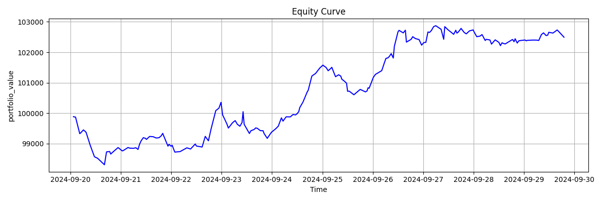

# Recurrent-RL-in-Trading-

## 📚 Understanding POMDP in Financial Trading

### What is a POMDP?

A **Partially Observable Markov Decision Process (POMDP)** is an extension of the Markov Decision Process (MDP) used in reinforcement learning (RL). In a **POMDP**, the agent does **not have full visibility of the true environment state**. Instead, it receives **partial observations** and must infer hidden state information to make optimal decisions.

Formally, a POMDP is defined by the tuple:

**POMDP = (S, A, O, T, R, Ω, γ)**

- **S**: Set of possible *states* of the environment.
- **A**: Set of *actions* the agent can take.
- **O**: Set of *observations* the agent receives.
- **T**: *Transition probability* function: `T(s, a, s') = P(s' | s, a)`
- **R**: *Reward function*: `R(s, a)` or `R(s, a, s')`
- **Ω**: *Observation probability function*: `Ω(s', a, o) = P(o | s', a)`
- **γ**: Discount factor, `0 < γ ≤ 1`

---

### 🤖 Why POMDP is Important in Trading

Financial markets are inherently **partially observable**:
- True market dynamics (e.g., institutional order flow, hidden liquidity, global macroeconomic states) are **not fully observable**.
- Agents rely on **OHLCV data**, technical indicators, and limited market history as proxies for state.
- Noise, delay, and non-stationarity in financial signals make it difficult to define the *true state*.

Therefore, the **trading problem is more accurately modeled as a POMDP** rather than a standard MDP.

---

### 🔁 Role of Recurrent Neural Networks (RNNs) in POMDPs

To deal with partial observability, we use **Recurrent Neural Networks (RNNs)** such as:
- **LSTM (Long Short-Term Memory)**
- **GRU (Gated Recurrent Unit)**

These networks **retain memory** over past observations and actions, effectively building a *belief state* (internal representation) of the environment. This makes them highly suitable for POMDPs.

#### 🔑 Key Benefits of RNNs in Trading:
- Capture **temporal dependencies** in price movements.
- Learn to **remember significant past events** (e.g., breakouts, mean reversion signals).
- Avoid fixed-length input constraints (e.g., unlike CNNs or FFNs).
- Encode sequences of actions and observations as a dynamic hidden state.

---

### 📈 POMDP + RRL: A Powerful Combination for Trading

By combining the **POMDP framework** with **Recurrent Reinforcement Learning**, we enable agents to:
- Infer unobservable dynamics from sequences of market data.
- Learn effective **long-term trading strategies**.
- Model **uncertainty** and **delayed effects** in trade outcomes.

This approach is especially useful for:
- High-frequency trading (HFT)
- Swing trading with delayed feedback
- Trading under regime changes

---

### 🛠️ Example Use in This Repository

In this repository, we implement Recurrent RL agents that:
- Receive partial observations (e.g., windowed OHLCV features).
- Use an RNN layer to maintain a hidden state.
- Optimize trading policy using PPO with sequence-based inputs.

Check the [`model/`](./model) folder for LSTM-based Actor-Critic implementations.

---
## 🚀 Getting Started

###  Training

To train a Recurrent Reinforcement Learning (RRL) agent on market data:

```bash
python training.py
``` 
This script initializes the environment, loads market data, builds the LSTM-based policy network, and trains the agent using a recurrent RL algorithm (e.g., PPO, A2C, or DRQN).

You can modify hyperparameters, network architecture, or observation windows inside training.py.

🔍 Backtesting
After training, evaluate your model using historical data:

``` bash

python backtesting.py
```
The script runs the trained model on unseen data and computes key metrics like total returns, Sharpe ratio, drawdown, trade log, and win rate.

Visualizations include equity curves, profit/loss distributions, and trade heatmaps.

📦 This project uses the excellent backtrader library:

A Python framework for backtesting trading strategies with ease. It allows strategy creation, indicator integration, and fast, interactive visualizations.

You can install it via pip:

``` bash
pip install backtrader
Or check their GitHub: https://github.com/mementum/backtrader.git
```
📂 Directory Structure
``` bash

.
├── training.py          # Train your recurrent RL agent
├── backtesting.py       # Backtest the trained agent
├── models/              # Model architectures (e.g., LSTM-based actor-critic)
├── data/                # Market data files (OHLCV CSVs) Train_data and Test_data 
├── utils/               # Preprocessing, visualization, data analysis
├── results/             # training_results and backtesting_results
├── figures/             # backtesting and training all the result figures 
├── tensorboard_logs/    # logging all the training results
└── README.md
```

## 📈 OHLCV Interactive Chart

- Download and open the interactive [ohlcv.html](./figures/ohlcv_train_test_split.html) chart locally in your browser.

## 📊 Trade Performance Visualization

### 📈 Equity Curve


### 💰 Cumulative Profit Curve


### 📚 References

- Hausknecht & Stone. *"Deep Recurrent Q-Learning for POMDPs"*. arXiv 2015.
- Moody & Saffell. *"Learning to Trade via Direct Reinforcement."* 2001.

